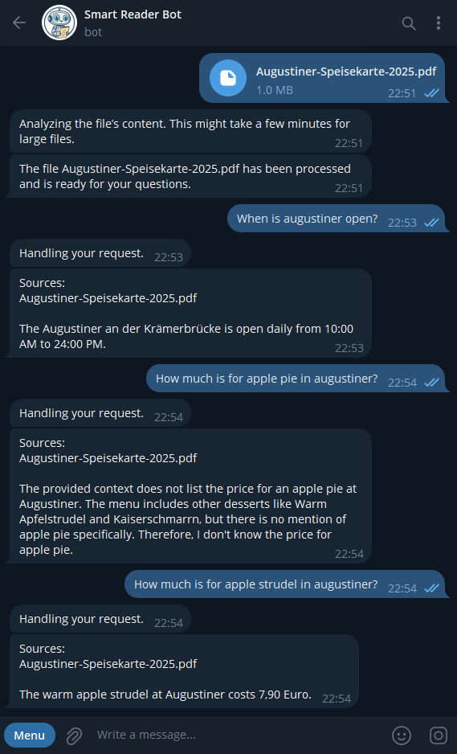

# SmartReaderBot 📚

The **SmartReaderBot** is a Telegram bot designed to help users interact with information from their documents using a **Retrieval-Augmented Generation (RAG)** pipeline powered by **Large Language Models (LLMs)**. It is a tool for Telegram users who need to extract information from text-based resources such as PDFs, Word files, or plain text.

---

## Key Features ✨

- **RAG Pipeline**: Combines retrieval-based and generative AI to provide precise and contextually relevant answers to user queries.
- **File Support**: Converts text-based files (e.g., PDFs, Word documents) into Markdown format using **[MarkItDown](https://github.com/microsoft/markitdown)**, making them accessible for processing.
- **FAISS Database**: Stores embeddings of text chunks for fast and accurate similarity search.
- **Customizable Models**: Easily switch between different LLMs, embedding and reranking models via the `config.py` file.
- **Text Chunking**: Uses **Langchain** to split documents into manageable chunks for processing and retrieval.
- **Multi-Language Support**: Allows users to interact with the bot in their preferred language (currently supports English, German and Russian).
- **Allowlist System**: Only allows access to the bot for users authorized by admin.

---

## How It Works 🛠

1. **File Upload**: Users upload text-based files (e.g., PDFs, Word documents) to the bot.
2. **File Conversion**: The bot converts the file into Markdown format using **[MarkItDown](https://github.com/microsoft/markitdown)**.
3. **Text Processing**: The text is cleaned and split into chunks using **Langchain**.
4. **Embedding Storage**: Embeddings are generated for each chunk and stored in a **FAISS database**.
5. **Query Handling**: When a user asks a question, the bot retrieves the most relevant text chunks from the database and sends them to the LLM for generating a response.
6. **Response Delivery**: The bot sends the LLM-generated response back to the user.

**Note**: The bot does not support images or other non-textual content.

**Usage examples**

I uploaded a [menu of Augustiner](https://augustiner-erfurt.de/wp-content/uploads/download/Augustiner-Speisekarte-2025.pdf) to Bot and asked about opening hours and prises:



---

## Getting Started 🚀

**Clone the repository**:
   ```bash
   git clone https://github.com/trofimovaolga/Smart-Reader-Bot.git
   cd Smart-Reader-Bot
   ```

**Install dependencies**:
   ```bash
   pip install -r requirements.txt
   ```

**Configure the Bot**:
   - Create your own Telegram bot using **@BotFather**.
   - Add `.env` file with Telegram bot token **TG_BOT_TOKEN**, telegram nickname of admin **ADMIN_NICKNAME**, API key for an LLM **LLM_API_KEY** and endpoint url **LLM_ENDPOINT**.
   - Update the `config.py` file with your preferred models and other settings. Modify the **supported_languages** list to include the languages you want to support and add the corresponding translations in `resources/bot_messages.json`.
   - Add authorized users to the allowlist.

**Run the Bot**:
   ```bash
   python main.py
   ```

**Interact with the Bot**:
   - Start the bot on Telegram by sending `/start`.
   - Upload a text-based file.
   - Ask questions.

**Bot Commands**
   - `/start`: Start the bot and receive a welcome message.
   - `/set_lang`: Set the preferred language for the bot.
   - `/sources`: List user's resources.
   - `/add_admin <username>`: Add an admin user (admin-only).
   - `/add_user <username>`: Add a regular user (admin-only).
   - `/del_user <username>`: Remove a user (admin-only).
   - `/show_users`: List all users and their roles (admin-only).


---

Enjoy using **SmartReaderBot**!

For any questions or issues, please open an issue on GitHub or contact me by email `olgatrofimova96@gmail.com`.
